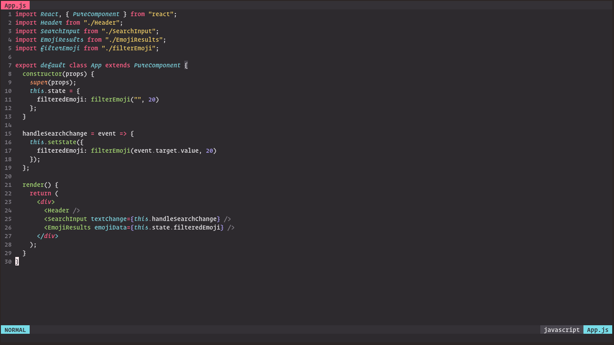
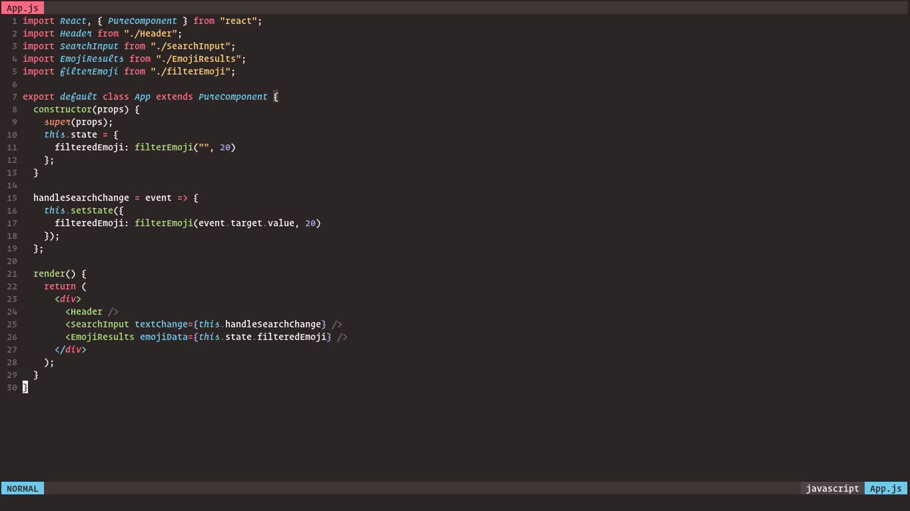
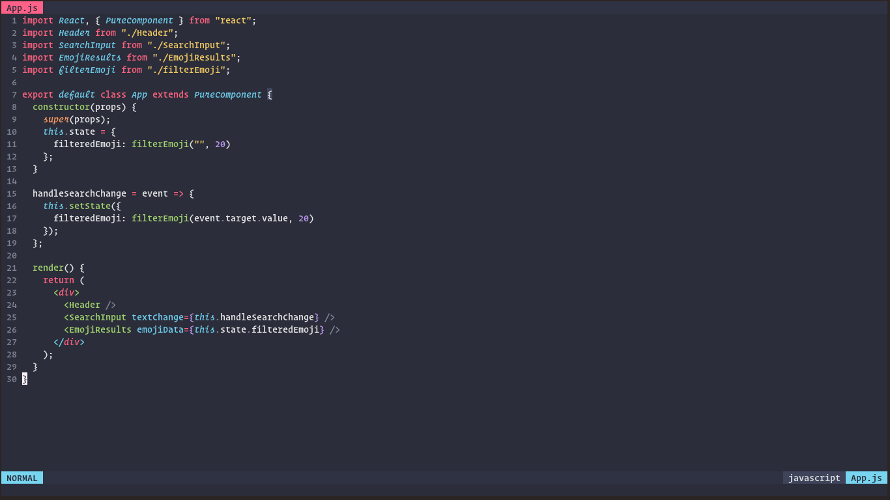
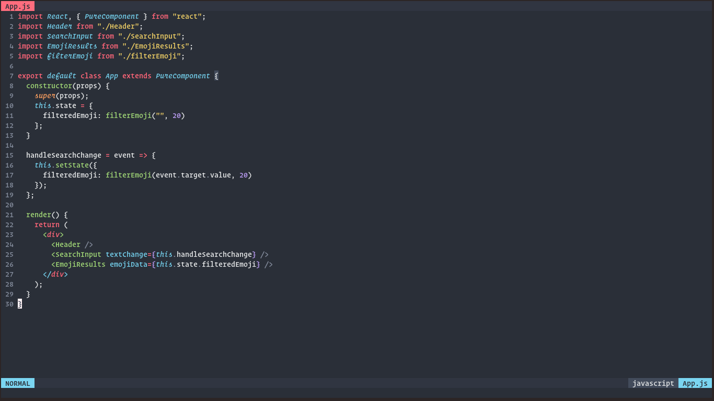

<p align="center">
	
</p>

<h2 align="center">
Shusia
</h2>



<h2 align="center">
Espresso
</h2>



<h2 align="center">
Andromeda
</h2>



<h2 align="center">
Atlantis
</h2>



<h2 align="center">
Maia
</h2>


Originally by [sainnhe](https://github.com/sainnhe)

This color scheme is based on [Monokai Pro](https://monokai.pro/vscode), the contrast is adjusted to be a bit lower while keeping the colors vivid enough.

The `shusia` and `maia` variants are based on `monokai pro` and `monokai machine` respectively. I'm not going to port all variants of [Monokai Pro](https://monokai.pro/vscode) because I don't like some of them. In addition, I designed some new variants inspired by other color schemes.

In my fork, i added `espresso` variant, based on `monokai ristretto`

## Features

- High contrast but within acceptable range.
- Vivid colors.
- Customizable.
- Rich support for common file types and plugins.
- [Italic support](https://github.com/sainnhe/icursive-nerd-font) 🎉

## Installation

### Via Plugin Manager

Take [vim-plug](https://github.com/junegunn/vim-plug) for example:

```vim
Plug 'ghifarit53/sonokai'
```

For better syntax highlighting support, please install [sheerun/vim-polyglot](https://github.com/sheerun/vim-polyglot).

## Usage

### Vim

Put this in your vimrc:

```vim
" important!!
set termguicolors

" the configuration options should be placed before `colorscheme sonokai`
let g:sonokai_style = 'espresso'
let g:sonokai_enable_italic = 1
let g:sonokai_disable_italic_comment = 1

colorscheme sonokai
```

See [Configuration](https://github.com/sainnhe/sonokai#configuration) for more configuration options.

If you want to apply this color scheme temporarily, run this command in vim(**this may cause colors to break**):

```vim
:colorscheme sonokai
```

#### Lightline

To enable [lightline](https://github.com/itchyny/lightline.vim) color scheme, put this in your vimrc:

```vim
let g:lightline = {}
let g:lightline.colorscheme = 'sonokai'

" or this line
let g:lightline = {'colorscheme' : 'sonokai'}
```

To apply it without reloading:

```vim
:let g:lightline.colorscheme = 'sonokai'
:call lightline#init()
:call lightline#colorscheme()
```

#### Other ports

Sorry, no `sonokai espresso` ports at this time for vim-airline, zsh, and alacritty

## License

[MIT](./LICENSE) © sainnhe
